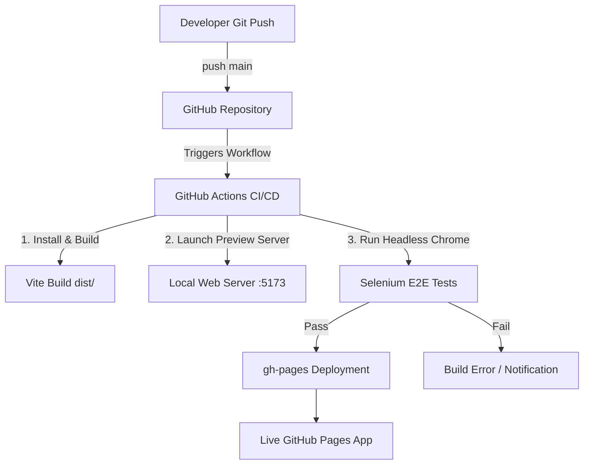

# React Deployment & Selenium E2E Testing Guide
> **Project**: Sanjeevani AI (`pdd-sanjeevani-ai`)  
> **Stack**: Vite + React 19 + TypeScript + Tailwind CSS + Selenium WebDriver + GitHub Actions

---

## 🏗️ Architecture Pipeline



---

## 📋 Table of Contents
- [Step 1: Push Project to GitHub](#step-1--push-project-to-github)
- [Step 2: Install gh-pages Package](#step-2--install-gh-pages-package)
- [Step 3: Update package.json & vite.config.ts](#step-3--update-packagejson--viteconfigts)
- [Step 4: Build & Deploy to GitHub Pages](#step-4--build--deploy-to-github-pages)
- [Step 5: Enable GitHub Pages in Repository Settings](#step-5--enable-github-pages-in-repository-settings)
- [Step 6: Access the Live Application](#step-6--access-the-live-application)
- [Step 7: Configure React Routing for GitHub Pages](#step-7--configure-react-routing-for-github-pages)
- [Step 8: Rebuild & Redeploy](#step-8--rebuild--redeploy)
- [Step 9: Verify Deployment](#step-9--verify-deployment)
- [Step 10: Add Selenium E2E Testing Dependencies](#step-10--add-selenium-e2e-testing-dependencies)
- [Step 11: Create Selenium Test Directory Structure](#step-11--create-selenium-test-directory-structure)
- [Step 12: Add Stable Element IDs for Automation](#step-12--add-stable-element-ids-for-automation)
- [Step 13: Run Selenium Test Locally](#step-13--run-selenium-test-locally)
- [Step 14: Setup GitHub Actions Workflow](#step-14--setup-github-actions-workflow)
- [Step 15: Automatic CI/CD Pipeline Verification](#step-15--automatic-cicd-pipeline-verification)

---

## Step 1 — Push Project to GitHub
Initialize your Git repository, commit all codebase files, and push to your target GitHub repository:

```bash
git init
git add .
git commit -m "Initial frontend release with Sanjeevani AI features"
git branch -M main
git remote add origin https://github.com/YOUR_USERNAME/YOUR_REPO.git
git push -u origin main
```
> *Replace `YOUR_USERNAME` and `YOUR_REPO` with your actual GitHub account and repository names.*

---

## Step 2 — Install `gh-pages` Package
Install `gh-pages` as a development dependency:

```bash
npm install gh-pages --save-dev
```

---

## Step 3 — Update `package.json` & `vite.config.ts`

### 1. `package.json` Configuration
Open [package.json](file:///c:/Arun/SIMATS/PDD%20Sanjeevani%20Ai/package.json) and configure the `homepage` property and deployment scripts:

```json
{
  "homepage": "https://YOUR_USERNAME.github.io/YOUR_REPO",
  "scripts": {
    "dev": "vite",
    "build": "tsc -b && vite build",
    "lint": "eslint .",
    "preview": "vite preview",
    "predeploy": "npm run build",
    "deploy": "gh-pages -d dist",
    "login": "mocha selenium-tests/tests/login.test.js --timeout 30000",
    "test:e2e": "mocha selenium-tests/tests/*.test.js --timeout 30000"
  }
}
```

> [!IMPORTANT]
> Because Sanjeevani AI is built using **Vite**, the build output directory is `dist` (unlike traditional `react-scripts` which uses `build`). Ensure `"deploy": "gh-pages -d dist"` is used.

### 2. `vite.config.ts` Base Path Setup
Open [vite.config.ts](file:///c:/Arun/SIMATS/PDD%20Sanjeevani%20Ai/vite.config.ts) and set the base path so assets load relative to GitHub Pages subdirectories:

```typescript
import { defineConfig } from 'vite'
import react from '@vitejs/plugin-react'

export default defineConfig({
  plugins: [react()],
  base: process.env.VITE_BASE_PATH || './',
  server: {
    allowedHosts: true
  }
})
```

---

## Step 4 — Build & Deploy to GitHub Pages
Execute the deployment command:

```bash
npm run deploy
```

This script automatically:
1. Runs `npm run build` (`predeploy` hook)
2. Compiles TypeScript and creates the production bundle in `dist/`
3. Publishes `dist/` to the `gh-pages` branch on GitHub.

---

## Step 5 — Enable GitHub Pages
1. Open your repository on GitHub.
2. Go to **Settings** → **Pages**.
3. Under **Build and deployment**:
   - **Source**: Select `Deploy from branch`.
   - **Branch**: Select `gh-pages` / `/ (root)`.
4. Click **Save**.

---

## Step 6 — Access the Live Application
GitHub Pages will make your web application available at:

```
https://YOUR_USERNAME.github.io/YOUR_REPO
```

---

## Step 7 — Configure React Routing for GitHub Pages
GitHub Pages static file hosting does not support fallback rewrites for deep client-side URL routes on page refresh (resulting in `404 Not Found`).

In Sanjeevani AI, client-side view state or `HashRouter` is used to maintain URL state seamlessly across subpaths without server-side rewrite rules.

```tsx
// For standard React Router projects:
// Replace BrowserRouter with HashRouter:
import { HashRouter as Router, Routes, Route } from 'react-router-dom';

export function AppRoutes() {
  return (
    <Router>
      <Routes>
        <Route path="/" element={<Welcome />} />
        <Route path="/admin/login" element={<AdminAuth />} />
        <Route path="/doctor/login" element={<DoctorAuth />} />
        <Route path="/patient/login" element={<PatientAuth />} />
      </Routes>
    </Router>
  );
}
```

---

## Step 8 — Rebuild & Redeploy
After applying router updates:

```bash
npm run build
npm run deploy
```

---

## Step 9 — Verify Deployment
Perform post-deployment verification:
- [x] Homepage loads cleanly without 404 error
- [x] Admin, Doctor, and Patient Login interfaces load
- [x] Refreshing the page retains current view route
- [x] Assets (CSS, JavaScript, Images) load properly

Example URL format:
`https://YOUR_USERNAME.github.io/YOUR_REPO/#/admin/login`

---

## Step 10 — Add Selenium E2E Testing Dependencies
Install `selenium-webdriver`, `mocha`, and `chromedriver`:

```bash
npm install selenium-webdriver mocha chromedriver --save-dev
```

---

## Step 11 — Create Selenium Test Directory Structure
Create the following directory layout inside your project:

```
PDD Sanjeevani Ai/
├── selenium-tests/
│   ├── package.json
│   └── tests/
│       └── login.test.js
├── .github/
│   └── workflows/
│       └── selenium-login.yml
```

---

## Step 12 — Add Stable Element IDs for Automation
To ensure Selenium locators remain reliable, add explicit `id` attributes to input elements and submit buttons across your auth components:

### Example from [AdminAuth.tsx](file:///c:/Arun/SIMATS/PDD%20Sanjeevani%20Ai/src/routes/Public/AdminAuth.tsx):
```tsx
<input 
  id="email"
  type="email" 
  value={email}
  onChange={(e) => setEmail(e.target.value)}
/>

<input 
  id="password"
  type="password" 
  value={password}
  onChange={(e) => setPassword(e.target.value)}
/>

<button id="login-button" type="submit">
  Login to Dashboard
</button>
```

---

## Step 13 — Run Selenium Test Locally

### 1. Test Script Configuration ([login.test.js](file:///c:/Arun/SIMATS/PDD%20Sanjeevani%20Ai/selenium-tests/tests/login.test.js))
```javascript
import { Builder, By, until } from 'selenium-webdriver';
import chrome from 'selenium-webdriver/chrome.js';
import assert from 'assert';

describe('Sanjeevani AI - E2E Login Automated Test Suite', function () {
  this.timeout(30000);
  let driver;

  const BASE_URL = process.env.TEST_URL || 'http://localhost:5173';

  beforeEach(async function () {
    const options = new chrome.Options();
    options.addArguments('--headless=new');
    options.addArguments('--no-sandbox');
    options.addArguments('--disable-dev-shm-usage');
    options.addArguments('--window-size=1280,800');

    driver = await new Builder()
      .forBrowser('chrome')
      .setChromeOptions(options)
      .build();
  });

  afterEach(async function () {
    if (driver) await driver.quit();
  });

  it('Automated Login Verification', async function () {
    await driver.get(`${BASE_URL}/admin/login`);

    const emailField = await driver.wait(until.elementLocated(By.id('email')), 10000);
    await emailField.sendKeys('admin@sanjeevani.ai');

    const passwordField = await driver.findElement(By.id('password'));
    await passwordField.sendKeys('admin123');

    const loginBtn = await driver.findElement(By.id('login-button'));
    await loginBtn.click();

    await driver.sleep(1500);
    const currentUrl = await driver.getCurrentUrl();
    assert.ok(currentUrl.includes('admin') || currentUrl.includes('dashboard'));
  });
});
```

### 2. Execute Local Test
In terminal:

```bash
npm run login
```

---

## Step 14 — Setup GitHub Actions Workflow
Create [.github/workflows/selenium-login.yml](file:///c:/Arun/SIMATS/PDD%20Sanjeevani%20Ai/.github/workflows/selenium-login.yml):

```yaml
name: Sanjeevani AI CI/CD & Selenium E2E Tests

on:
  push:
    branches: [ main ]
  pull_request:
    branches: [ main ]

jobs:
  build-and-test:
    runs-on: ubuntu-latest

    steps:
      - name: Checkout Repository
        uses: actions/checkout@v4

      - name: Setup Node.js Environment
        uses: actions/setup-node@v4
        with:
          node-version: '20'
          cache: 'npm'

      - name: Install Dependencies
        run: npm ci

      - name: Build Project
        run: npm run build

      - name: Start Server & Wait for Port
        run: |
          npx vite preview --port 5173 &
          npx wait-on http://localhost:5173 --timeout 30000

      - name: Run Headless Selenium Tests
        env:
          TEST_URL: http://localhost:5173
        run: npm run login

      - name: Deploy to GitHub Pages
        if: github.ref == 'refs/heads/main' && github.event_name == 'push'
        env:
          GITHUB_TOKEN: ${{ secrets.GITHUB_TOKEN }}
        run: |
          git config user.name "github-actions[bot]"
          git config user.email "github-actions[bot]@users.noreply.github.com"
          npm run deploy
```

---

## Step 15 — Automatic CI/CD Pipeline Flow

```
Developer Push → GitHub Repository → GitHub Actions Trigger → Build & Package 
  → Launch Headless Chrome & Run Selenium E2E Tests → Validate Dashboard Redirect 
  → Deploy to GitHub Pages (gh-pages) → Live Production Verification
```

---
> [!NOTE]
> All initial configuration files, stable IDs (`#email`, `#password`, `#login-button`), Selenium test files, and GitHub Actions workflows are now fully prepared in the repository.
