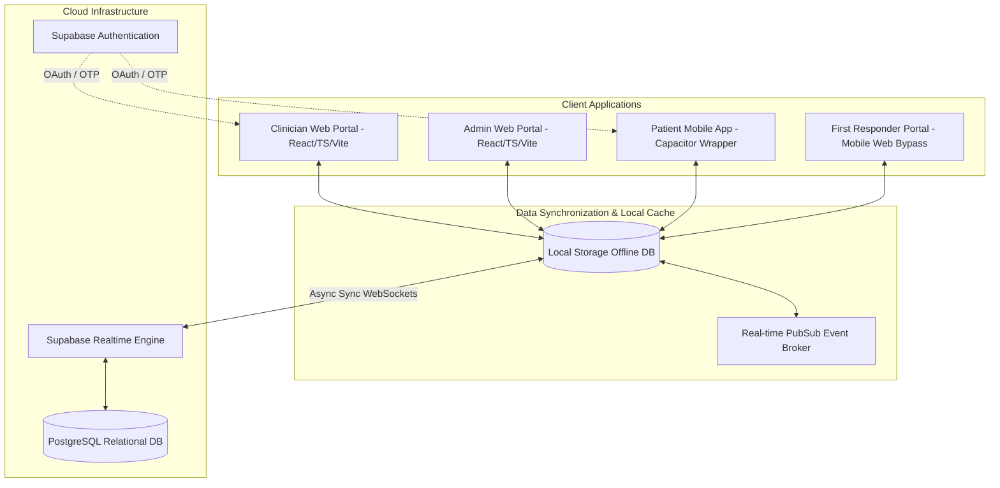

# Sanjeevani AI — Technical Documentation & Product Blueprint
*Empowering patient recovery and clinical vigilance through closed-loop post-prescription monitoring.*

---

## 1. Executive Summary

Sanjeevani AI is a real-time, interactive healthcare system designed to close the critical feedback loop between doctors and patients *after* a prescription has been issued. Traditional electronic medical records (EMR) systems operate statically—once a patient leaves the clinic, they enter a clinical "blind spot" where compliance is unmonitored and drug-induced adverse events often go unrecognized until emergency hospitalizations occur. 

Sanjeevani AI bridges this gap. By utilizing a dual-platform architecture (Web for clinicians and hospital administrators; Android for patients and emergency responders), the system combines daily patient-reported outcome tracking, compliance logging, real-time vital sign telemetry, and a specialized rule-based clinical safety engine to flag complications instantly, forecast patient deterioration, and provide life-saving zero-auth medical bypass access during acute crises.

---

## 2. Technical Architecture & Component Stack

Sanjeevani AI is designed with an **offline-first, cloud-synchronized architecture**. Below is the comparative stack breakdown:

### 2.1 Clinician & Admin Web Application
* **Core Framework**: React 19 (Strict mode, TypeScript compiler version ~6.0.2).
* **Build System & Tooling**: Vite 8 (Hot Module Replacement, optimized static resource chunks).
* **Styling**: Custom CSS design architecture utilizing custom variables for responsiveness, supplemented by utility classes for dashboard panels.
* **Vector Iconography**: Lucide React.
* **Analytics & Telemetry**: Recharts 3.8.1 (Responsive interactive SVG render engine for clinical curves, BP trends, and heart metrics).
* **Hosting**: Vercel-ready serverless configuration (`vercel.json` rewrites for SPA routing).

### 2.2 Patient Android Application
* **Wrapper Container**: Capacitor v8.4 (`@capacitor/core`, `@capacitor/cli`, `@capacitor/android`). Packages the compiled React build folder (`dist`) into native Android code blocks.
* **Native Compilation**: Compiles down to standard Android packages (`.apk` format).
* **Platform Adaptability**: Employs platform detection (`Capacitor.isNativePlatform()` and platform checks) to dynamically display native-inspired splash screens (`Splash.tsx`), mobile-first bottom sheets, and hide non-applicable web headers.

### 2.3 Backend, Authentication & Cloud DB
* **Backend Provider**: Supabase Serverless BaaS.
* **Database**: PostgreSQL Relational Database, structured with relational integrity (Foreign keys linking patients, visits, and reports).
* **Real-time Synchronizer**: WebSockets-driven Supabase subscriptions client (`@supabase/supabase-js`).
* **Authentication Modules**:
  * **Clinicians & Admins**: Email & password authentication with secure JWT authorization hooks.
  * **Patients**: Dual verification flows supporting phone-number-based OTP credentials and Google OAuth integrations.
* **Offline-First Synchronization**:
  * Leverages browser `localStorage` as a fast local database cache.
  * Automatically seeds baseline demo data locally.
  * Launches an asynchronous background synchronization process (`syncFromSupabase()`) on mount, pulling remote database tables and updating the local cache.
  * Uses a local PubSub system (`realtimeBroker`) to trigger UI updates across screens when the sync completes.

---

## 3. Database Schema Blueprint (Supabase Tables)

The PostgreSQL database on Supabase mirrors the data models used locally. Below are the key tables and fields:

### 3.1 `doctors` (Clinician Profiles)
* `id`: UUID (Primary Key, matches Supabase Auth UID)
* `name`: Text (Clinician's full name)
* `email`: Text (Unique login email)
* `specialty`: Text (e.g., Cardiology, Endocrinology)
* `clinic_name`: Text (Hospital or clinic branch)
* `avatar_url`: Text (Optional profile image)
* `hospital_id`: UUID (Foreign Key linking to `admins.id`)
* `approval_status`: Text (`pending` | `accepted` | `rejected` - managed by hospital administrators)

### 3.2 `patients` (Patient Records)
* `id`: Text (Primary Key, formatted as `SJV-PAT-XXXXXX`)
* `name`: Text (Full name)
* `age`: Integer (Patient age)
* `phone`: Text (Verification telephone)
* `email`: Text (Unique email)
* `blood_group`: Text (e.g., A+, O-, B+)
* `allergies`: JSONB (Array of allergen, severity, and reaction objects)
* `chronic_conditions`: JSONB (Array of string conditions, e.g., "Asthma", "CKD")
* `active_medications`: JSONB (Array of active prescribed drug objects with dosages and frequencies)
* `emergency_contact`: JSONB (Emergency contact name, phone, email, and address)
* `vitals`: JSONB (Current vital signs snapshot: BP, HR, Temp, O2 Sat, Glucose, Weight)

### 3.3 `visits` (Clinical Consultation Records)
* `id`: Text (Primary Key)
* `patient_id`: Text (Foreign Key linking to `patients.id`)
* `doctor_id`: UUID (Foreign Key linking to `doctors.id`)
* `doctor_name`: Text (Cached doctor name for rendering)
* `date`: Date/Timestamp (Visit date)
* `reason_for_visit`: Text (Primary complaint)
* `vitals`: JSONB (Vitals measured at the time of consultation)
* `diagnosis`: Text (Clinical determination)
* `notes`: Text (Detailed doctor clinical notes)
* `prescriptions`: JSONB (Active prescription details linking to visit)

### 3.4 `feedbacks` (Post-Prescription Symptom Tracking logs)
* `id`: Text (Primary Key)
* `patient_id`: Text (Foreign Key linking to `patients.id`)
* `patient_name`: Text (Cached patient name)
* `prescription_id`: Text (Links to original prescription)
* `drug_name`: Text (Name of the drug being logged)
* `date`: Date/Timestamp (Feedback entry date)
* `feeling`: Text (`Better` | `Same` | `Worse` | `Severe Side Effects`)
* `symptoms`: JSONB (Array of selected checkboxes: `headache`, `dizziness`, `vomiting`, `allergy`, `chest pain`, `breathing issue`, `weakness`)
* `notes`: Text (Patient textual comments)
* `ai_severity`: Text (`stable` | `elevated` | `critical`)
* `ai_analysis`: Text (Generated clinical audit text summarizing the risk flags)
* `read_by_doctor`: Boolean (Flag for doctor alert resolution)

### 3.5 `medication_logs` (Daily Pill Compliance Tracker)
* `id`: Text (Primary Key)
* `patient_id`: Text (Foreign Key)
* `prescription_id`: Text (Links to prescription)
* `medicine_name`: Text (Name of the medicine)
* `date`: Text (YYYY-MM-DD format)
* `time_slot`: Text (`morning` | `afternoon` | `night`)
* `status`: Text (`taken` | `missed`)
* `logged_at`: Timestamp (Actual timestamp of submission)

### 3.6 `predictions` (AI Health Risk Forecasting)
* `prediction_id`: Text (Primary Key)
* `patient_id`: Text (Foreign Key)
* `ai_score`: Integer (0 - 100 risk score)
* `predicted_risk`: Text (Diagnostic prediction title)
* `severity`: Text (`stable` | `moderate` | `high` | `critical`)
* `prediction_notes`: Text (Detailed reasoning flags)
* `generated_at`: Timestamp (Generation time)

---

## 4. Platform Feature Breakdown

### 4.1 Clinician Web Application
1. **Clinician Dashboard**:
   * **Active Patient Monitoring Stream**: Live scrollable feed of patient compliance status and reported check-ins.
   * **Drug Safety Alerts Panel**: High-priority alert banner displaying patient profiles matching critical AI safety alarms.
   * **Priority Watchlists**: Aggregates patients whose predicted risk profiles have degraded to "Critical" or "High" severity levels.
2. **Prescription Creator with Real-time AI Audit**:
   * Enables doctors to add drugs with dose parameters.
   * On submission or addition, the `AISafetyEngine` automatically intersects the proposed drugs with the patient's existing active medications, documented allergies, chronic conditions, and current vital levels, blocking hazardous scripts before they are written.
3. **Electronic Medical Records (EMR) Profiles**:
   * Consolidated patient timelines detailing all historical visits, diagnostic reports, and side-effect feedback tracking.
4. **Diagnostic Report Uploader**:
   * Supports categorizing reports under Lab, Cardiology, Radiology, or General.
   * Simulates AI parsing of summaries, storing reports on Supabase.
5. **Clinical Healthcare Analytics**:
   * Interactive Recharts charts detailing population risk distribution, prevented interaction statistics, and 48-hour predicted emergency trends.

### 4.2 Patient Android Application
1. **Daily Medication Checklist**:
   * Renders active pills broken down into morning, afternoon, and night slots.
   * Logging check-in updates compliance rates in real-time.
2. **Post-Prescription Interactive Check-in Form**:
   * An interactive dialog prompts the patient to report how they feel ("Better", "Same", "Worse", "Severe Side Effects").
   * Interactive checklists allow selecting symptoms (weakness, chest pain, dizziness, allergy, vomiting, breathing issues, headache).
   * Generates instant feedback via the `AISafetyEngine` indicating safety status (e.g., *"Sanjeevani AI Status: Stable Recovery"*).
3. **Emergency QR Pass Generator**:
   * Generates a digital wallet-style Emergency ID card with key vitals, blood type, severe allergies, and primary contact phone numbers.
   * Includes a scan-bypass QR code that links directly to the Emergency Portal.

### 4.3 Zero-Auth First Responder Portal
* **Bypass Link URL Access**: Instantiated when a responder scans the patient's Emergency QR code.
* **Unified Emergency Portal**:
  * Runs a no-auth bypass query pulling the specific patient's critical vitals, severe drug exclusion alerts, and active medication list.
  * **Direct Call Dialing**: Highlights primary contact details and allows first responders to place a direct phone call bypass immediately with a single click.

---

## 5. The Sanjeevani AI Clinical Safety Engine

The platform operates on a specialized rule-based intelligence engine (`AISafetyEngine`) containing pre-defined medical reference rules and diagnostic algorithms:

### 5.1 Drug-Drug Interactions (DDI)
Cross-matches proposed medicines against known dangerous interactions:
* **Warfarin + Aspirin / Ibuprofen** $\rightarrow$ *CRITICAL*: Highly increased risk of gastrointestinal bleeding/hemorrhage.
* **Lisinopril + Spironolactone** $\rightarrow$ *CRITICAL*: Hyperkalemia risk causing cardiac arrhythmias.
* **Sildenafil + Nitroglycerin** $\rightarrow$ *CRITICAL*: Severe, life-threatening hypotension drop.
* **Amiodarone + Digoxin** $\rightarrow$ *CRITICAL*: Doubled digoxin concentration (severe cardiotoxicity).

### 5.2 Allergy Flagging
Maps drug naming strings against documented drug-allergen classes (e.g., matching Amoxicillin to Penicillin-allergy classes).

### 5.3 Chronic Condition Contraindications
* Checks for **Metformin** in patients diagnosed with **Chronic Kidney Disease (CKD)** $\rightarrow$ *CRITICAL*: Elevated risk of lactic acidosis.
* Checks for **Beta-Blockers (Propranolol, Metoprolol)** in patients with **Asthma** $\rightarrow$ *CRITICAL*: Risk of triggering severe bronchospasms.
* Checks for **NSAIDs (Ibuprofen)** in patients with **Severe Hypertension (Systolic BP > 150)** $\rightarrow$ *WARNING*: Sodium retention leading to blood pressure spikes.

### 5.4 Risk Calculation Algorithm
The engine evaluates the overall patient risk score (0 to 100) dynamically using the following weights:
$$\text{Risk Score} = 10 \text{ (Baseline)} + \text{Vitals Penalties} + \text{Alert Penalties} + \text{Feedback History Penalties} + \text{Contraindication Penalties}$$

* **Vitals Penalties**:
  * Systolic BP $> 160$ or $< 85$: $+25$
  * Oxygen Saturation $< 90\%$: $+35$ (Depressed Saturation $90-94\%$: $+15$)
  * Heart Rate abnormal ($>115$ or $<45$): $+20$
* **Alert Penalties**:
  * Each Critical Alert detected: $+30$
  * Each Warning Alert detected: $+15$
* **Feedback History Penalties**:
  * Worsening trajectory (multiple consecutive "Worse" logs): $+20$
  * Repeated side-effect complaints (e.g., persistent dizziness): $+25$
* **Contraindication Penalties**:
  * Active Metformin + CKD: $+15$
  * Active Beta-blocker + Asthma: $+20$

**Risk Classification:**
* **Stable** ($\text{Score} < 30$, no critical alerts)
* **Elevated** ($\text{Score} \geq 30$ or any warning alerts)
* **Critical** ($\text{Score} \geq 60$ or any critical alerts)

---

## 6. Gaps and Novelty Analysis

### 6.1 Gaps in Current Market Solutions
* **EMR Systems (Epic, Cerner)**: Excellent for inside-the-hospital charting, but lack proactive outreach. The patient becomes a "black box" once they leave the hospital, leading to unmonitored symptoms.
* **Medication Tracker Apps (Mango Health, MyTherapy)**: Track compliance, but function as isolated, siloed consumer apps. They do not feed compliance data or vital statistics back to the prescribing doctor.
* **Patient Portals (MyChart)**: Highly passive. Patients must manually navigate menus to message a doctor, and there is no automated AI safety scanner auditing their daily side effects.
* **Emergency ID Products**: Rely on physical bracelets or manual medical ID screens on locked mobile phones, which are frequently outdated or lack active prescription/vital history.

### 6.2 Sanjeevani AI Innovations (Novelty)
1. **Closed-Loop Interactive Symptom Telemetry**: Bridges the communication gap by combining medication schedules with daily symptom feedback forms, feeding results directly into clinician watchlists in real-time.
2. **Automated Symptom-to-Drug Side Effect Mapping**: The AI safety engine dynamically evaluates patient check-ins, mapping symptoms (e.g., dizziness) against the side-effect profiles of their active drugs, alerting the doctor of potential adverse events (e.g., bleeding risks under anticoagulants).
3. **No-Auth Zero-Trust Emergency QR Bypass**: First responders can scan a patient's Emergency QR pass to instantly view clinical vitals, severe drug contraindications, active medication lists, and emergency contact links without requiring login credentials.
4. **Predictive 48-Hour Emergency Forecasting**: Utilizes vital trend deviations and compliance logs to forecast clinical deterioration before an emergency occurs, shifting care from reactive to proactive.

---

## 7. Comparative Product Matrix

| Feature | **Sanjeevani AI** | Traditional EMRs (Epic / Cerner) | Standard Portals (MyChart) | Consumer Med Trackers |
| :--- | :---: | :---: | :---: | :---: |
| **Post-Prescription Feedback Loops** | **Yes (Daily Check-ins)** | No | No (Passive Messaging) | Yes (No Doctor Sync) |
| **Real-time AI DDI & Allergy Auditing** | **Yes** | Yes (Static Rulebooks) | No | No |
| **Live Doctor Safety Watchlist Alerts** | **Yes** | No | No | No |
| **First Responder Emergency QR Bypass** | **Yes** | No | No | No |
| **Predictive Emergency Risk Forecasting** | **Yes (48-Hr Trend)** | No | No | No |
| **Offline-First Synchronization** | **Yes** | No | No | Yes (Siloed) |

---

## 8. Summit Presentation Agenda (Pitch Blueprint)

*Use this structured timeline to present Sanjeevani AI at the summit tomorrow:*

### Slide 1: The Problem — The Post-Prescription "Blind Spot"
* **Core Message**: Point out that $30\%$ of all emergency hospital readmissions are due to medication non-compliance or undetected drug side effects. Once a patient leaves the clinic, the doctor has no way of knowing if the prescription is working or causing harm.

### Slide 2: The Solution — Sanjeevani AI
* **Core Message**: Introduce Sanjeevani AI as a closed-loop monitoring platform. Show the dual-view interface (Clinician Web Dashboard and Patient Android Mobile App) synchronized in real-time using Supabase.

### Slide 3: The Engine — Real-Time Clinical AI Safety
* **Core Message**: Highlight the `AISafetyEngine`. Explain how it runs real-time audits on drug-drug interactions, allergies, and contraindications. Walk through the risk score algorithm and how it flags high-risk patients.

### Slide 4: Live Demonstration Flow (Recommended Script)
* **Step 1**: Log in as a Doctor and show the **Clinician Dashboard**.
* **Step 2**: Open a patient record, prescribe a medication (e.g., Warfarin), and demonstrate how the AI checks for allergies and interactions.
* **Step 3**: Switch to the **Patient Mobile App**. Log daily compliance and submit feedback reporting "Severe Side Effects" and "Dizziness".
* **Step 4**: Return to the **Clinician Dashboard** to show the real-time red alert card appearing instantly, demonstrating how the platform closes the loop.

### Slide 5: Emergency QR Code Protection
* **Core Message**: Show the **Emergency QR Pass Card**. Demonstrate how a first responder scans the QR code to bypass auth and instantly view vital signs, severe allergies, and emergency contact details.

### Slide 6: Product Comparison & Gaps
* **Core Message**: Present the comparative matrix showing how Sanjeevani AI differs from traditional EMRs and consumer medication trackers by offering proactive, connected care.

### Slide 7: Future Outlook & Scaling
* **Core Message**: Detail the roadmap, including direct integration with wearable health monitors, LLM-based clinical notes parsing, and multi-hospital database syncing.
